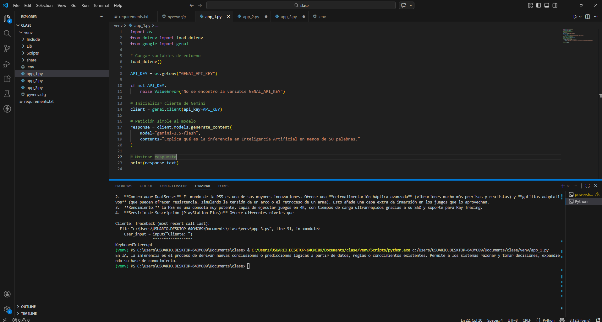

# 📘 Integración con Google Gemini usando Python

## 📌 Descripción del Proyecto

Este proyecto tiene como objetivo implementar un script en **Python** que utilice la librería **google-genai** para interactuar con el modelo **Gemini**, permitiendo realizar peticiones básicas, procesamiento inteligente de textos y la gestión de conversaciones interactivas con roles y contexto definidos.

El taller refuerza el uso de **ingeniería de prompts**, **system instructions**, **few-shot learning** y buenas prácticas de programación.

---

## 🎯 Objetivo General

Implementar un sistema en Python capaz de:

- Realizar consultas simples al modelo Gemini.
- Procesar textos largos según una tarea específica.
- Gestionar un chat interactivo con historial y roles definidos.

---

## 🛠️ Requisitos Previos

Antes de ejecutar el proyecto, asegúrate de contar con:

- Python 3.9 o superior
- Una clave de API válida para Google Gemini
- Instalación de la librería requerida:

```bash
pip install google-genai
📂 Estructura del Proyecto
gemini-python-project/
│
├── main.py
├── procesador_textos.py
├── chat_soporte.py
└── README.md
🖼️ Evidencia – Ejercicio 1

Inserta aquí las capturas correspondientes a la ejecución del script


